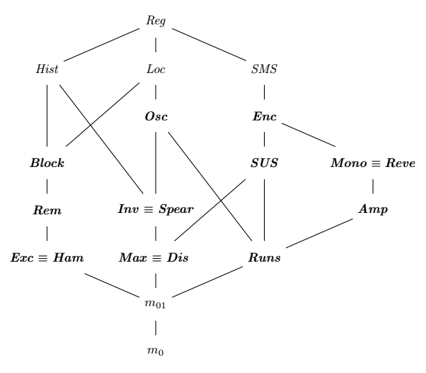
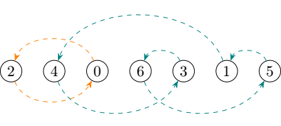
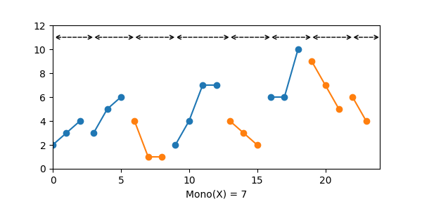
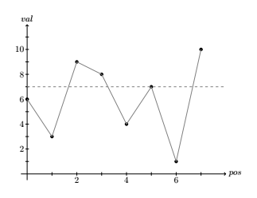
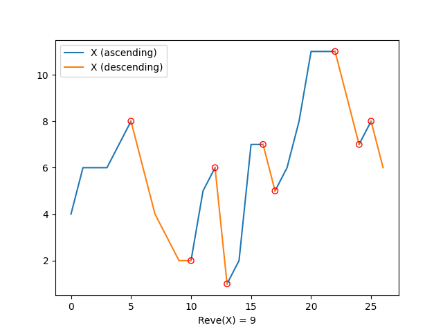

*Measures of disorder* are functions used to measure how much a sequence differs from its sorted permutation. Several loose definitions of measures of disorder exist in the literature; in this documentation, we use the formal definition provided by Vladimir Estivill-Castro in *Sorting and Measures of Disorder*. That is, a *measure of disorder* $M$ is a non-negative real function that accepts a sequence $X$ and satifies the following properties:
1. When $X$ is sorted, $M(X) = \min_{\lvert Y \rvert=\lvert X \rvert}\{M(Y)\}$. In other words, a measure of disorder *grows* with the amount of disorder in $X$, and reaches its minimum when $X$ is sorted.
2. Order isomorphism: if the relative order of elements in two sequences $X$ and $Y$ is the same, then $M(X) = M(Y)$.

In the rest of this document, we also use the following notation:
* Sequences are ordered, and use angle brackets as delimiter, ex: $\langle 1, 3, 2, 4, 10 \rangle$.
* $\lvert X \rvert$ corresponds to the number of elements in the sequence $X$ (its size).
* Given two sequences $X$ and $Y$, $X \lt Y$ means that every of $X$ compares less than every element in $Y$ (assume similar meaning for other ordering operators).
* Given two sequences $X$ and $Y$, $XY$ corresponds to their concatenation. Similarly $\langle e \rangle X$ is the concatenation of the sequence made of the single element $e$ and of the sequence $X$.
* The expression "subsequence of $X$" refers to a sequence obtained by removing any number of possibly non-adjacent elements from $X$, unless specified otherwise.

## Measures of presortedness

*Measures of presortedness* are a specific category of *measures of disorder* formally defined by Heikki Mannila in *Measures of presortedness and optimal sorting algorithms*:

> Given two sequences $X$ and $Y$ of distinct elements, a measure of presortedness *M* is a non-negative integer function that satisfies the following properties:
>
> 1. If $X$ is sorted, then $M(X) = 0$
> 2. If $X$ and $Y$ are order isomorphic, then $M(X) = M(Y)$
> 3. If $X$ is a subsequence of $Y$, then $M(X) ≤ M(Y)$
> 4. If $X \le Y$, then $M(XY) ≤ M(X) + M(Y)$
> 5. $M(⟨e⟩X) ≤ \lvert X \rvert + M(X)$ for every element $e$ of the domain

Mannila's goal was to define strong properties allowing to reason about the minimum amount of work required for an adaptive sorting algorithm to sort a sequence with little disorder. Namely:
* Criterion 1 above tries to formally represent the intuitive notion that no work is needed to sort a sequence that is already sorted.
* Criterion 4 considers that if $X \le Y$, then sorting $XY$ should take no more work than sorting $X$ and $Y$ individually.
* Explanation for the other criteria follow a similar logic can be found in the aforementioned paper.

Some authors found that definition to be overly strict for their application, and considered that it excludes several useful metrics that have historically been used as measures of disorders. Jingsen Chen was one of them, and proposed to loosen the criteria in *Computing and ranking measures of presortedness* to encompass more existing measures of disorder:

> Let $a$, $b$ and $c$ be positive constants. Given two sequences $X$ and $Y$ of distinct elements, a measure of presortedness *M* is a function that satisfies the following properties:
>
> 1. If $X$ is sorted, then $M(X) = a$
> 2. If $X$ and $Y$ are order isomorphic, then $M(X) = M(Y)$
> 3. If $X$ is a subsequence of $Y$, then $M(X) ≤ M(Y)$
> 4. If $X \le Y$, then $M(XY) ≤ M(X) + M(Y) + b$
> 5. $M(⟨e⟩X) ≤ \lvert X \rvert + M(X) + c$ for every element $e$ of the domain

That loosened definition however is arguably less suited to estimate the amount of work need to order a sequence. We include it here for the sake of exposition and to highlight that vocabulary in the domain has historically been debated, but in the rest of this document the expression *measure of presortedness* refers to any measure of disorder that satisfies Mannila's five criteria.

Speaking of which, Mannila actually deemed those five criteria insufficiently strong to reason about the minimum amount of work required to sort a sequence. Following in his steps, Estivill-Castro proposes in *Sorting and Measures of Disorder* a couple of new properties he considers "intuitively desirable" to formally represent the idea of presortedness:
* **Prefix monotonicity:** given a measure of disorder $M$ and three sequences $X$, $Y$ and $Z$, if $X \le Z$, $Y \le Z$ and $M(X) \le M(Y)$ then $M(XZ) \le M(YZ)$.
* **Monotonicity:** given a measure of disorder $M$ and four sequences $W$, $X$, $Y$ and $Z$, if $W \le X \le Z$, $W \le Y \le Z$ and $M(X) \le M(Y)$, then $M(WXZ) \le M(WYZ)$.

The *monotonicity* property implies the *prefix monotonicity* one. A measure of presortedness that also satisfies the *monotonicity* property is called in a *monotonic measure of presortedness*.

### Adaptive algorithms and measures of presortedness

*Measures of presortedness and optimal sorting algorithms* also defines what it means for a sorting algorithm to be $M$-optimal or $M$-adaptive with regard to a measure of presortedness $M$. We first need a few definitions.

Let $X$ be a sequence of elements, and let $S_X$ be set of all permutations of that sequence:

$$\mathit{below}_M(X) = \{ \pi \vert \pi \in S_X \text{ and } M(\pi) \le M(X) \}$$

Let $T_S(X)$ be the number of steps needed for an algorithm $S$ to sort $X$. A sorting algorithm is said to be $M$-optimal if and only if, for some constant $c$, we have for all $X$:

$$T_S(X) \le c \cdot max\{\lvert X \rvert, \log{} |\mathit{below}_M(X)|\}$$

In other words, a sorting algorithm is considered $M$-optimal if it takes a number of steps that is within a constant factor of the lower bound of $M$ to sort a sequence. For example a $\mathit{Rem}$-optimal algorithm should be able to sort any sequence in $O(\lvert X \rvert \log{} \mathit{Rem}(X))$ steps.

### Partial ordering of measures of disorder

Early on, authors have been wanting to prove that some measures of disorder were "better" than other, though it quickly appeared that just comparing the raw numbers by the measures was not enough. Alistair Moffat proposed the following intuitive definition in *Ranking measures of sortedness and sorting nearly sorted lists*:

> Let $M_1$ and $M_2$ be two measures of disorder:
>
> * $M_1$ is algorithmically finer than $M_2$ (denoted $M_1 \le_\mathit{alg} M_2$) if and only if any $M_1$-optimal sorting algorithm is also $M_2$-optimal.
> * $M_1$ and $M_2$ are algorithmically equivalent (denoted $M_1 =_\mathit{alg} M_2$) if and only if $M_1 \le_\mathit{alg} M_2$ and $M_2 \le_\mathit{alg} M_1$.

While useful to understand what we want from a partial order on measures of disorder, the definition above does not help a lot when it comes to actually proving that a measure is algorithmically finer than another. To better compare two measures of disorder, Jingsen Chen introduces the following operator in *Computing and ranking measures of presortedness*:

> Let $M_1$ and $M_2$ be two measures of disorder:
>
> * $M_1$ is superior to $M_2$ (denoted $M_1 \preceq M_2$) if and only if there exists a constant $c$ such as $\lvert \mathit{below}_{M_1}(X) \rvert \le c \cdot \lvert \mathit{below}_{M_2}(X) \rvert$ for any sequence $X$.
> * $M_1$ and $M_2$ are equivalent (denoted $M_1 \equiv M_2$) if and only if $M_1 \preceq M_2$ and $M_2 \preceq M_1$.

That definition seems to match the one proposed much earlier by Alistair Moffat and Ola Petersson in *A Framework for Adaptive Sorting*, though the authors use the symbol $\supseteq$ instead of $\preceq$.

To prove that two measures of disorder were equivalent, authors have used the simpler method of showing that there exists some non-0 constants $c$ and $d$ such as $M_1(X) \le c \cdot M_2(X) \le d \cdot M_1(X)$. For example, the result $\mathit{Max} \equiv \mathit{Dis}$ below was originally obtained by proving that $\mathit{Max}(X) \le \mathit{Dis}(X) \le 2 \mathit{Max}(X)$ for any sequence $X$.

The graph below shows the partial ordering of several measures of disorder:
- *Reg* is a measure of presortedness superior to all other ones in the graph.
- *m₀* is a measure of presortedness that always returns 0.
- *m₀₁* is a measure of presortedness that returns 0 when $X$ is sorted and 1 otherwise.



This graph is a modified version of the one found in *A framework for adaptive sorting*. The relations of *Mono* and *Amp* with other measures of disorder are empirically derived [original research][original-research] and known to be incomplete (unknown relations with *Osc* and *Loc*).

The measures of disorder in bold in the graph are available in **cpp-sort**, the others are not.

## Measures of disorder in cpp-sort

In **cpp-sort**, measures of disorder are implemented as instances of some specific function objects. They take a range or a pair of iterators as input and return how much disorder there is contained in the sequence according to the measure. Measures of disorder follow the *unified sorting interface*, allowing a certain degree a freedom in the parameters they accept:

```cpp
using namespace cppsort;
auto a = probe::inv(collection);
auto b = probe::rem(vec.begin(), vec.end());
auto c = probe::ham(li, std::greater{});
auto d = probe::runs(integers, std::negate{});
```

Note however that most of these algorithms can be expensive. Using them before an actual sorting algorithm has little interest if any. They are instead meant to be profiling tools: when sorting is a critical part of your application, you can use these measures on typical data and check whether it is mostly sorted according to one measure or another, then you may be able to find a sorting algorithm known to be optimal with regard to this specific measure.

Measures of disorder can be used with the *sorter adapters* from the library. Even though most of the adapters are meaningless with measures of disorder, some of them can still be used to mitigate space and time:

```cpp
// With explicit template parameter
auto inv = cppsort::indirect_adapter<decltype(cppsort::probe::inv)>{};

// With CTAD
auto inv = cppsort::indirect_adapter(cppsort::probe::inv);
```

Measures of disorder live in the namespace `cppsort::probe`. Although all of them are available in their own header, it is still possible to include all of them at once with the following include:

```cpp
#include <cpp-sort/probes.h>
```

### `max_for_size`

All measures of disorder in the library have the following `static` member function:

```cpp
template<typename Integer>
static constexpr auto max_for_size(Integer n)
    -> Integer;
```

It takes an integer `n` and returns the maximum value that the measure of disorder can return for a sequence of size `n`.

## Available measures of disorder

Measures of disorder are pretty formalized, so the names of the functions in the library are short and generally correspond to the ones used in the literature, with a few exceptions. A justification is given whenever a name does not exactly match the ones from the literature, or when the definition differs.

### *Amp*

```cpp
#include <cpp-sort/probes/amp.h>
```

Let's consider the following functions to compare two elements elements of a sequence:

$$
\mathit{comp}(x, y)=
\begin{cases}
1 & \text{ if } x \lt y\\
-1 & \text{ if } x \gt y\\
0 & \text{otherwise}
\end{cases}
$$

We define $\mathit{Amp}(X)$ as follows:

$$\mathit{Amp}(X) = \lvert X \rvert - \mathit{PTP}(X) - N_{\mathit{eq}}(X) - 1$$

Where $N_{\mathit{eq}}(X)$ is the number of pairs of neighbors that compare equivalent in $X$, and $\mathit{PTP}(X)$ is the number of unique values in the prefix sum of the sequence obtained by applying $comp$ to every pair of adjacent elements in $X$.


| Complexity  | Memory      | Iterators     | Monotonic |
| ----------- | ----------- | ------------- | --------- |
| n           | 1           | Forward       | No        |

`max_for_size`: $\lvert X \rvert - 2$ for [zigzag permutations][zigzag-permutation].

**Note:** *Amp* does not respect Mannila's criterion 4: $\mathit{Amp}(\langle 1, 2, 3 \rangle) = 0$ and $\mathit{Amp}(\langle 6, 5, 4 \rangle) = 0$, but $\mathit{Amp}(\langle 1, 2, 3, 6, 5, 4 \rangle) = 4$.

*New in version 2.1.0*

### *Block*

```cpp
#include <cpp-sort/probes/block.h>
```

Computes the number of elements in $X$ that aren't followed by the same element in the sorted permutation.

Our implementation is slightly different from the original description in *Sublinear merging and natural mergesort* by S. Carlsson, C. Levcopoulos and O. Petersson:
* It doesn't add 1 to the general result, thus returning 0 when $X$ is sorted and respecting Mannila's first criterion for what makes a measure of presortedness (though this change might be responsible for the breakage of criterion 4).
* It explicitly handles *equivalent elements*, while the original formal definition makes it difficult.

| Complexity  | Memory      | Iterators     | Monotonic |
| ----------- | ----------- | ------------- | --------- |
| n log n     | n           | Forward       | No        |

`max_for_size`: $\lvert X \rvert - 1$ when $X$ is sorted in reverse order.

**Note:** *Block* does not seem to respect Mannila's criterion 3 in the presence of *equivalent elements*.

**Note²:** `probe::block` does not respect Mannila's criterion 4: $\mathit{Block}(\langle 1, 0 \rangle) = 1$ and $\mathit{Block}(\langle 2, 3 \rangle) = 0$, but $\mathit{Block}(\langle 1, 0, 2, 3 \rangle) = 2$.

### *Dis*

```cpp
#include <cpp-sort/probes/dis.h>
```

Computes the maximum distance determined by an inversion.

| Complexity  | Memory      | Iterators     | Monotonic |
| ----------- | ----------- | ------------- | --------- |
| n           | n           | Bidirectional | Yes       |
| n log n     | 1           | Forward       | Yes       |

When enough memory is available `probe::dis` runs in O(n) using an algorithm described by T. Altman and Y. Igarashi in *Roughly Sorting: Sequential and Parallel Approach*, otherwise it falls back to an O(n log n) algorithm that does not require extra memory. If forward iterators are passed, the O(n log n) algorithm is always used.

`max_for_size`: $\lvert X \rvert - 1$ when the last element of $X$ is smaller than the first one.

### *Enc*

```cpp
#include <cpp-sort/probes/enc.h>
```

Computes an approximation of the number of encroaching lists that can be extracted from $X$ (see *Encroaching lists as a measure of presortedness* by S. Skiena). Encroaching lists are better explained by their construction algorithm: create an empty list $L$ of lists given a sequence $X$ of elements, for each element $E$ of $X$:
1. If $L$ is empty, create a new list with $E$.
2. Otherwise, compare $E$ to the head and tail of the rightmost list of $L$.
  2.1 If $E$ is greater than the head, find the lefmost list that has a head smaller than $E$, and prepend $E$ to that list.
  2.2 Otherwise, it $E$ is smaller than the tail, find the lefmost list that has a tail greater than $E$, and append $E$ to that list.
  3.3 Otherwise append a new list to $L$ with the element $E$.

Those lists are called encroaching because the bounds of a given list "encroach" those of all lists on its right.

The number of encroaching lists does not satisfy the formal definition of a measure of presortedness because it returns $1$ for non-empty sorted sequences instead of $0$, which does not respect first Mannila's criterion. Using $\mathit{Enc}(X) - 1$ does not work either because it does not respect Mannila's fourth criterion. To circumvent these issues, `probe::enc` implements an equivalent measure of disorder $M_\mathit{Enc}$ proposed by V. Estivill-Castro in *Sorting and Measures of Disorder*, which satisfies all of Mannila's criteria for what makes a measure of presortedness:

$$
M_\mathit{Enc}(X)=
\begin{cases}
0 & \text{if } X \text{ is sorted,}\\
\mathit{Enc}(X_\mathit{tail}) & \text{otherwise, where } X_\mathit{tail} \text{ is } X \text{ without its leading ascending run.}
\end{cases}
$$

| Complexity  | Memory      | Iterators     | Monotonic |
| ----------- | ----------- | ------------- | --------- |
| n log n     | n           | Forward       | No        |

`max_for_size`: $\lfloor \frac{\lvert X \rvert}{2} \rfloor$ when all values extracted from $X$ are within the bounds of already extracted encroaching lists (for example the sequence $\langle 10, 0, 9, 1, 8, 2, 7, 3, 6, 4, 5 \rangle$ triggers the worst case).

### *Exc*

```cpp
#include <cpp-sort/probes/exc.h>
```

Computes the minimum number of exchanges required to sort $X$, which corresponds to $\lvert X \rvert$ minus the number of cycles in the sequence. A cycle corresponds to a number of elements in a sequence that need to be rotated to be in their sorted position; for example, let $\langle 2, 4, 0, 6, 3, 1, 5 \rangle$ be a sequence, the cycles are $\langle 0, 2 \rangle$ and $\langle 1, 3, 4, 5, 6 \rangle$ so $\mathit{Exc}(X) = \lvert X \rvert - 2 = 5$.



**Warning:** `probe::exc` generally returns a result greater than the minimum number of exchanges required to sort $X$ when it contains *equivalent elements*. This is because extending $\mathit{Exc}$ to *equivalent elements* is a NP-hard problem (see *On the Cost of Interchange Rearrangement in Strings* by Amir et al). The function does handle such elements in some simple cases, but not in the general case.

| Complexity  | Memory      | Iterators     | Monotonic |
| ----------- | ----------- | ------------- | --------- |
| n log n     | n           | Forward       | Yes       |

`max_for_size`: $\lvert X \rvert - 1$ when every element in $X$ is one element away from its sorted position.

**Note:** *Exc* does not respect Mannila's criterion 3 (a subsequence contains no more disorder than the whole sequence): $\mathit{Exc}(\langle 3, 1, 2, 0 \rangle) = 1$, but $\mathit{Exc}(\langle 3, 1, 2 \rangle) = 2$.

*Warning: this algorithm might be noticeably slower when the passed range is not random-access.*

### *Ham*

```cpp
#include <cpp-sort/probes/ham.h>
```

Computes the number of elements in $X$ that are not in their sorted position, which corresponds to the [Hamming distance][hamming-distance] between $X$ and its sorted permutation.

| Complexity  | Memory      | Iterators     | Monotonic |
| ----------- | ----------- | ------------- | --------- |
| n log n     | n           | Forward       | Yes       |

`max_for_size`: $\lvert X \rvert$ when every element in $X$ is one element away from its sorted position.

**Note:** *Ham* does not respect Mannila's criterion 3 (a subsequence contains no more disorder than the whole sequence): $\mathit{Ham}(\langle 3, 1, 2, 0 \rangle) = 2$, but $\mathit{Ham}(\langle 3, 1, 2 \rangle) = 3$.

**Note²:** *Ham* does not respect Mannila's criterion 5: $\mathit{Ham}(\langle 4, 1, 2, 3 \rangle) \not \le \lvert \langle 1, 2, 3 \rangle \rvert + \mathit{Ham}(\langle 1, 2, 3 \rangle)$.

### *Inv*

```cpp
#include <cpp-sort/probes/inv.h>
```

Computes the number of inversions in $X$, where an inversion corresponds to a pair (a, b) of elements not in order. For example, the sequence $\langle 2, 1, 3, 0 \rangle$ has 4 inversions: $(2, 1)$, $(2, 0)$, $(1, 0)$ and $(3, 0)$.

| Complexity  | Memory      | Iterators     | Monotonic |
| ----------- | ----------- | ------------- | --------- |
| n log n     | n           | Forward       | Yes       |

`max_for_size`: $\lfloor \frac{\lvert X \rvert(\lvert X \rvert - 1)}{2} \rfloor$ when $X$ is sorted in reverse order.

### *Max*

```cpp
#include <cpp-sort/probes/max.h>
```

Computes the maximum distance an element in $X$ must travel to find its sorted position.

| Complexity  | Memory      | Iterators     | Monotonic |
| ----------- | ----------- | ------------- | --------- |
| n log n     | n           | Forward       | Yes       |

`max_for_size`: $\lvert X \rvert - 1$ when $X$ is sorted in reverse order.

### *Mono*

```cpp
#include <cpp-sort/probes/mono.h>
```

Computes the number of non-increasing and non-decreasing consecutive runs of adjacent elements that need to be removed from $X$ to make it sorted.

The measure of disorder is slightly different from its original description in [*Sort Race*][sort-race] by H. Zhang, B. Meng and Y. Liang:
* It subtracts 1 from the number of runs, thus returning 0 when $X$ is sorted.
* It explicitly handles non-increasing and non-decreasing runs, not only the strictly increasing or decreasing ones.



| Complexity  | Memory      | Iterators     | Monotonic |
| ----------- | ----------- | ------------- | --------- |
| n           | 1           | Forward       | No        |

`max_for_size`: $\lfloor \frac{\lvert X \rvert + 1}{2} \rfloor - 1$ for [zigzag permutations][zigzag-permutation] (but not only those).

**Note:** `probe::mono` does not respect Mannila's criterion 4: $\mathit{Mono}(\langle 1, 2, 3, 4, 5 \rangle) = 0$ and $\mathit{Mono}(\langle 10, 9, 8, 7, 6 \rangle) = 0$, but $\mathit{Mono}(\langle 1, 2, 3, 4, 5, 10, 9, 8, 7, 6 \rangle) = 1$.

### *Osc*

```cpp
#include <cpp-sort/probes/osc.h>
```

Computes the *Oscillation* measure described by C. Levcopoulos and O. Petersson in *Adaptive Heapsort*, using an algorithm devised by J. Nehring.

Let $\lvert \lvert \mathit{Cross}(x_i) \rvert \rvert$ be the number of links between adjacent pairs that "cross" the value $x_i$. We define the oscillation measure as $\mathit{Osc}(X) = \sum_{i=0}^{\lvert X \rvert - 1} \lvert \lvert \mathit{Cross}(x_i) \rvert \rvert$.



In the illustration above, we can see that a horizontal line drawn from $x_5$ crosses three pairs of adjacent elements in the geometrical representation of the sequence $X = \langle 6, 3, 9, 8, 4, 7, 1, 10 \rangle$. Thus $\lvert \lvert \mathit{Cross}(x_5) \rvert \rvert = 3$. In this example, we have $\mathit{Osc(X) = 17}$.

| Complexity  | Memory      | Iterators     | Monotonic |
| ----------- | ----------- | ------------- | --------- |
| n log n     | n           | Forward       | No        |

`max_for_size`: it is reached when the values in $X$ are strongly oscillating, and equals $\frac{\lvert X \rvert(\lvert X \rvert - 2)}{2}$ when $\lvert X \rvert$ is even, and $\frac{\lvert X \rvert(\lvert X \rvert - 2) - 1}{2}$ when $\lvert X \rvert$ is odd.

**Note:** *Osc* does not seem to respect Mannila's criterion 3 in the presence of *equivalent elements*.

**Note²:** *Osc* does not respect Mannila's criterion 4: $\mathit{Osc}(\langle 0 \rangle) = 0$ and $\mathit{Osc}(\langle 3, 2, 1 \rangle) = 0$, but $\mathit{Osc}(\langle 0, 3, 2, 1 \rangle) = 2$.

**Note³:** *Osc* does not respect Mannila's criterion 5: $\mathit{Osc}(\langle 3, 0, 4, 2, 5, 1 \rangle) \not \le \lvert \langle 0, 4, 2, 5, 1 \rangle \rvert + \mathit{Osc}(\langle 0, 4, 2, 5, 1 \rangle)$, simplified: $11 \not \le 5 + 5$.

### *Rem*

```cpp
#include <cpp-sort/probes/rem.h>
```

Computes the minimum number of elements that must be removed from $X$ to obtain a sorted subsequence, which corresponds to $\lvert X \rvert$ minus the size of the [longest non-decreasing subsequence][longest-increasing-subsequence] of $X$.

| Complexity  | Memory      | Iterators     | Monotonic |
| ----------- | ----------- | ------------- | --------- |
| n log n     | n           | Forward       | Yes       |

`max_for_size`: $\lvert X \rvert - 1$ when $X$ is sorted in reverse order.

### *Reve*

```cpp
#include <cpp-sort/probes/reve.h>
```

The number of reversals in the growth direction of a sequence.



| Complexity  | Memory      | Iterators     | Monotonic |
| ----------- | ----------- | ------------- | --------- |
| n           | 1           | Forward       | No        |

`max_for_size`: $\lvert X \rvert - 2$ for [zigzag permutations][zigzag-permutation].

**Note:** `probe::reve` does not respect Mannila's criterion 4: $\mathit{Reve}(\langle 1, 2, 3, 4, 5 \rangle) = 0$ and $\mathit{Reve}(\langle 10, 9, 8, 7, 6 \rangle) = 0$, but $\mathit{Reve}(\langle 1, 2, 3, 4, 5, 10, 9, 8, 7, 6 \rangle) = 1$.

*New in version 2.2.0*

### *Runs*

```cpp
#include <cpp-sort/probes/runs.h>
```

Computes the number of non-decreasing runs in $X$ minus one.

| Complexity  | Memory      | Iterators     | Monotonic |
| ----------- | ----------- | ------------- | --------- |
| n           | 1           | Forward       | Yes       |

`max_for_size`: $\lvert X \rvert - 1$ when $X$ is sorted in reverse order.

### *Spear*

```cpp
#include <cpp-sort/probes/spear.h>
```

Spearman's footrule distance: sum of distances between the position of individual elements in $X$ and their position once $X$ is sorted (we use a stable sort to handle *equivalent elements*). Its use a a measure of disorder was proposed by P. Diaconis and R. L. Graham in *Spearman's Footrule as a Measure of Disarray*.

| Complexity  | Memory      | Iterators     | Monotonic |
| ----------- | ----------- | ------------- | --------- |
| n log n     | n           | Forward       | Yes       |

`max_for_size`: $\lfloor \frac{\lvert X \rvert^2}{2} \rfloor$ when $X$ is sorted in reverse order.

**Note:** *Spear* does not respect Mannila's criterion 5: $\mathit{Spear}(\langle 4, 1, 2, 3 \rangle) \not \le \lvert \langle 4 \rangle \rvert + \mathit{Spear}(\langle 1, 2, 3 \rangle)$.

**Note²:** $\lfloor \frac{\mathit{Spear}(X)}{2} \rfloor$ respects Mannila's criterion 5, and is a proper measure of presortedness. A future version of **cpp-sort** might replace the current implementation with one that halves its result.

### *SUS*

```cpp
#include <cpp-sort/probes/sus.h>
```

Computes the minimum number of non-decreasing subsequences (of possibly non-adjacent elements) into which $X$ can be partitioned, minus 1. It happens to correspond to the size of the [longest decreasing subsequence][longest-increasing-subsequence] of $X$ minus 1.

*SUS* stands for *Shuffled UpSequences* and was introduced in *Sorting Shuffled Monotone Sequences* by C. Levcopoulos and O. Petersson.

| Complexity  | Memory      | Iterators     | Monotonic |
| ----------- | ----------- | ------------- | --------- |
| n log n     | n           | Forward       | Yes       |

`max_for_size`: $\lvert X \rvert - 1$ when $X$ is sorted in reverse order.

## Other measures of disorder

Some additional measures of disorder have been described in the literature but do not appear in the partial ordering graph, or are not provided in the library. This section describes some of them but is not an exhaustive list.

### *DS*

A measure called *DS* appears in *Computing and ranking measures of presortedness* by J. Chen, and in some literature about measures of disorder online (including some earlier versions of this documentation). The measure corresponds to the one we call *Spear* in the library.

*Spear* is introduced under the name *D*, likely for (Spearman's Footrule) *Distance*, in *Spearman's Footrule as a Measure of Disarray* by P. Diaconis and R. L. Graham. Other sources give the name $D_S$, and similary give the name $D_H$ to *Ham*, for Hamming distance. I believe that's where the name *DS* comes from.

In other domains, that value is called *F* (for *Footrule*). It is no more helpful a name than *D* or *DS*, so I decided to use *Spear* for this library's name (for *Spearman*) - following the same naming pattern that led to *Ham* -, despite there being no precedent in the literature.

### *Las*, *Lds* and *Lads*

Those names tend to appear in papers authored by Jinseng Chen, such as *On Partitions and Presortedness of Sequences* and *Computing and Ranking Measures of Presortedness*:
* *Las(X)* is the length of the *longest ascending subsequence* of *X*. We do not provide it because it grows with _order_ in the sequence intead of growing with _disorder_. $\mathit{Rem}(X) = \lvert X \rvert - \mathit{Las}(X)$ is the closest measure provided by the library.
* *Lds(X)* is the length of the *longest descending subsequence* of *X*. It corresponds to to [$\mathit{SUS}$][probe-sus] in the library, the minimum number of increasing subsequences into which *X* can be decomposed.
* *Lads(X)* is an extension of both of the measures above, computing the minimum number of monotonic subsequences (ascending or descending) into which *X* can be decomposed. It is a different name for [*SMS*][probe-sms].

### *Par*

*Par* is described by V. Estivill-Castro and D. Wood in *A New Measure of Presortedness* as follows:

> *Par(X)* = min { *p* \vert $X$ is *p*-sorted }

The following definition is also given to determine whether a sequence is *p*-sorted:

> $X$ is *p*-sorted iff for all *i*, *j* ∈ {1, 2, ..., $\lvert X \rvert$}, *i* - *j* > *p* implies *Xj* ≤ *Xi*.

*Right invariant metrics and measures of presortedness* by V. Estivill-Castro, H. Mannila and D. Wood mentions that:

> In fact, $\mathit{Par}(X) = \mathit{Dis}(X)$, for all $X$.

In their subsequent papers, those authors consistently use *Dis* instead of *Par*, often accompanied by a link to *A New Measure of Presortedness*.

### *Pos*

*Pos* is described by V. Estivill-Castro and D. Wood in *Sorting, Measures of disorder, and Worst-case performance* as "the position number": the number of elements in a sequence that are not in their sorted position. This definition matches that of *Ham*, the Hamming distance between a sequence and its sorted permutation.

### *Radius*

T. Altman and Y. Igarashi mention the concept of *k*-sortedness and the measure *Radius*($X$) in *Roughly Sorting: Sequential and Parallel Approach*. However *k*-sortedness is the same as *p*-sortedness, and *Radius* is just another name for *Par* (and thus for *Dis*).

### *SMS*

*SMS* stands for *Shuffled Monotone Sequences* and was introduced in *Sorting Shuffled Monotone Sequences* by C. Levcopoulos and O. Petersson. It computes the minimum number of increasing or decreasing subsequences (of possibly non-adjacent elements) into which a sequence $X$ can be partitioned, minus 1.

The concept in itself is fiarly straightforward, yet the problem of computing $\mathit{SMS}(X) \le k$ in NP-complete, as shown by K. Wagner in *Monotonic coverings of finite sets*. For this reason, the library does not provide an implementation. It is technically possible to compute an approximation of $\mathit{SMS}(X)$ by repeatedly removing the longest monotonic subsequence from $X$.

Nevertheless we do know a few of the measure's properties:
* $1 \le \mathit{SMS}(X) \le \min {\mathit{SUS}(X), \mathit{SDS}(X)}$, where $\mathit{SUS}$ and $\mathit{SDS}$ respectivey standard for [*Shuffled UpSequences*][probe-sus] and *Shuffled DownSequences*, the first being a measure of presortedness that we provide.
* $\mathit{SMS}(X) \le \lfloor \sqrt{2n + \frac{1}{4}} - \frac{1}{2} \rfloor$, as proven by A. Brandstädt and D. Kratsch in *On partitions of permutations into increasing and decreasing subsequences*.


  [hamming-distance]: https://en.wikipedia.org/wiki/Hamming_distance
  [longest-increasing-subsequence]: https://en.wikipedia.org/wiki/Longest_increasing_subsequence
  [original-research]: Original-research.md#partial-ordering-of-mono
  [probe-sms]: Measures-of-disorder.md#sms
  [probe-sus]: Measures-of-disorder.md#sus
  [sort-race]: https://arxiv.org/ftp/arxiv/papers/1609/1609.04471.pdf
  [zigzag-permutation]: https://en.wikipedia.org/wiki/Alternating_permutation
