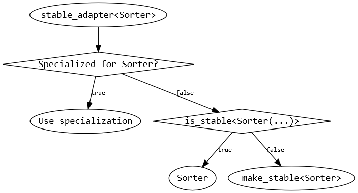
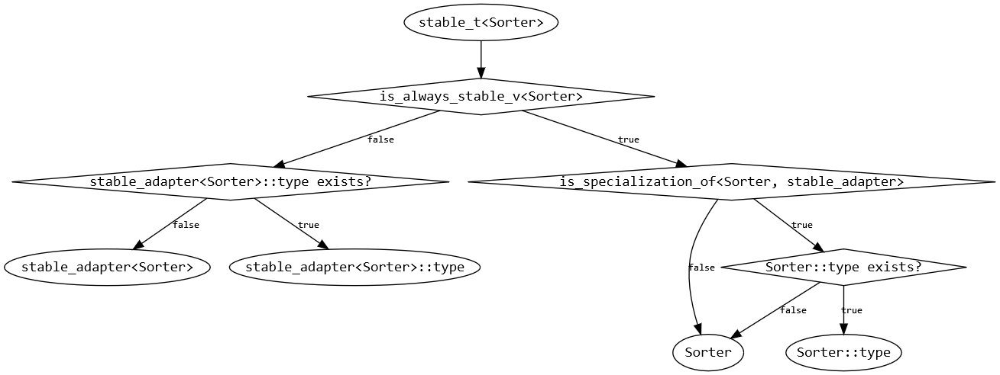

Sorter adapters are the main reason for using sorter function objects instead of regular functions. A *sorter adapter* is a class template that takes another `Sorter` template parameter and alters its behavior. The resulting class can be used as a regular sorter, and be adapted in turn. Note that some of the adapters are actually *[fixed-size sorter][fixed-size-sorters] adapters* instead of regular *sorter adapters*. It is possible to include all of the available adapters at once with the following directive:

```cpp
#include <cpp-sort/adapters.h>
```

In this documentation, we will call *adapted sorters* the sorters passed to the adapters and *resulting sorter* the sorter class that results from the adaption of a sorter by an adapter. If not specified, the stability and the iterator category of the *resulting sorter* is that of the *adapted sorter* provided there is a single *adapted sorter*.

In C++17, *sorter adapters* can be used in a function-like fashion thanks to `explicit` constructors (taking one or several sorters) by taking advantage of implicit [deduction guides][ctad]. The following example illustrates how it simplifies their use:

```cpp
// C++14
using sorter = indirect_adapter<quick_sorter>;
constexpr auto sort = sorter{};

// C++17
constexpr auto sort = indirect_adapter(quick_sort);
```

Most of the library's *sorter adapters* can store the passed *sorters* in their internals, allowing them to use adapt *stateful sorters*. Unless explicitly mentioned otherwise in an adapter's description, it is safe to assume that the *sorter adapters* in the library have the following properties:
* The *sorter adapter* stores a copy of every passed sorters in its internals and uses those copy when needed. If every *original sorter* is empty and default-constructible, then the *sorter adapter* is also empty and default-constructible. 
* If the *sorter adapter* adapts a single *sorter*, then it has a member function called `get()` which returns a reference to the internal *sorter* whose reference and `const` qualifications match those of the *sorter adapter* instance. If the *sorter adapter* is empty and default-constructible, then a default-constructed instance of the type of the *original sorter* is returned instead.
* If the *sorter adapter* is empty and default-constructible, then it can be converted to any function pointer whose signature matches that of its `operator()`.

It is worth noting that in the current state of things, sorters & adapters are expected to have a `const operator()`, and thus don't play nice with *mutable sorters*. There are plans to properly handle *mutable sorters* in the future: you can track [the corresponding issue][issue-104].

*Changed in version 1.5.0:* adapters can store the sorters they adapt, enabling the use of *stateful sorters*. The overall semantics of sorters and adapters have evolved accordingly.

## Available sorter adapters

The following sorter adapters and fixed-size sorter adapters are available in the library:

### `container_aware_adapter`

```cpp
#include <cpp-sort/adapters/container_aware_adapter.h>
```

Sorters in **cpp-sort** are typically container-agnostic: they only care about iterators, which is a strength since it means that they can work with any container satisfying a few simple iterator requirements. However, abstracting away containers also means that the sorting algorithms are unable to take interesting container structures into account. For example, a selection sort is generally unstable because it swaps non-adjacent elements, but it can be made stable by rotating the element in its final place instead; rotating is a O(n) operation given a mere iterator abstraction, but we know that list can splice elements in O(1) time instead, and it's somewhat of a shame to throw away that ability.

`container_aware_adapter` is a tool that allows to make the wrapped sorter container-aware and to use dedicated algorithms when sorting known containers. For example, when given an `std::list`, `container_aware_adapter<selection_sorter>` will use a dedicated algorithm that stably sorts the list with O(1) splice operations.

`container_aware_adapter` returns the result of the *adapted sorter* if any.

```cpp
template<typename Sorter>
struct container_aware_adapter;
```

Some sorters in the library already have dedicated algorithms for `std::list` and `std::forward_list`. Wrapping those sorters with `container_aware_adapter` will make their `operator()` call the dedicated algorithms instead of the default ones. The dedicated algorithms are only called when the *resulting sorter* is called with a full collection since iterators don't hold enough information. When called with a pair of iterators, the *resulting sorter* uses the raw *adapted sorter*.

An interesting property of dedicated sorting algorithms is that one can craft an algorithm for a structure that holds forward iterators even if the *adapted sorter* is only able to handle bidirectional iterators (*e.g.* `container_aware_adapter<insertion_sorter>` can handle an `std::forward_list` while it default implementation only handles bidirectional iterators).

### `counting_adapter`

```cpp
#include <cpp-sort/adapters/counting_adapter.h>
```

Unlike usual sorters, `counting_adapter::operator()` does not return `void` but the number of comparisons that have been needed to sort the iterable. It will adapt the comparison function so that it can count the number of comparisons made by any other sorter with a reasonable implementation. The actual number of comparisons needed to sort an iterable can be used as a heuristic in hybrid sorts and may constitute interesting information nevertheless.

The actual counter type can be configured with the template parameter `CountType`, which defaults to `std::size_t` if not specified.

```cpp
template<
    typename ComparisonSorter,
    typename CountType = std::size_t
>
struct counting_adapter;
```

Note that this adapter only works with sorters that satisfy the `ComparisonSorter` concept since it needs to adapt a comparison function.

### `drop_merge_adapter`

```cpp
#include <cpp-sort/adapters/drop_merge_adapter.h>
```

[Drop-merge sort][drop-merge-sort] is a [*Rem*-adaptive][probe-rem] sorting algorithm that isolates some of the elements to sort in a buffer in O(n) time in order to leave a single sorted run in the original collection, then it uses another algorithm to sort the elements isolated in a buffer, and merges the two resulting runs back into the original collection. `drop_merge_adapter` uses the *adapted sorter* to sort the (contiguous) buffer of isolated elements.

The *resulting sorter* always requires at least bidirectional iterators, no matter the iterator category of the *adapted sorter*. The *resulting sorter* is always unstable, no matter the stability of the *adapted sorter*.

```cpp
template<typename Sorter>
struct drop_merge_adapter;
```

Adapting any *sorter* with `drop_merge_adapter` effectively makes it [*Rem*-adaptive][probe-rem], making it a valuable tool to add adaptiveness to existing sorters.

*New in version 1.14.0*

### `hybrid_adapter`

```cpp
#include <cpp-sort/adapters/hybrid_adapter.h>
```

The goal of this sorter adapter is to aggregate several sorters into one unique sorter. The new sorter will call the appropriate sorting algorithm based on the iterator category of the collection to sort. If several of the aggregated sorters have the same iterator category, the first to appear in the template parameter list will be chosen, unless some SFINAE condition prevents it from being used. As long as the iterator categories are different, the order of the sorters in the parameter pack does not matter.

For example, the following sorter should call a pattern-defeating quicksort to sort a random-access collection, a vergesort to sort a bidirectional collection and a bubble sort to sort a forward collection:

```cpp
using general_purpose_sorter = hybrid_adapter<
    bubble_sorter,
    verge_sorter,
    pdq_sorter
>;
```

This adapter uses `cppsort::iterator_category` to check the iterator category of the sorters to aggregate. Therefore, if you write a sorter and want it to be usable with `hybrid_adapter`, you will need your sorter to provide an `iterator_category` type alias corresponding to one of the standard iterator tags. If you write specific sorters that only work with some specific types, you might want to SFINAE out the overloads of `operator()` when they are not valid instead of triggering a hard error. Doing so will allow to use them with fallback sorters in `hybrid_adapter` to handle the cases where the type to sort cannot be handled by your sorter.

`hybrid_adapter` returns the result of the *adapted sorter* called if any.

If `hybrid_adapter` is nested in another `hybrid_adapter`, those are flattened: for example `hybrid_adapter<A, hybrid_adapter<B, C>, D>` is flattened to `hybrid_adapter<A, B, C, D>`. This unwrapping exists so that the iterator categories of the sorters in the inner `hybrid_adapter` are seen by the outer one, and not only the fused iterator category of the inner `hybrid_adapter`.

If `hybrid_adapter` is wrapped into [`stable_adapter`][stable-adapter], it wraps every *adapted sorter* into `stable_adapter`, forwarding it to better get the specific behaviour f some sorters or adapters when wrapped into it.

The *resulting sorter*'s `is_always_stable` is `std::true_type` if and only if every *adapted sorter*'s `is_always_stable` is `std::true_type`. `is_stable` is specialized so that it will return the stability of the called *adapted sorter* with the given parameters. The iterator category of the *resulting sorter* is the most permissive iterator category among the *adapted sorters*.

*Changed in version 1.4.0:* nested `hybrid_adapter<A, hybrid_adapter<B, C>, D>` now unwrap to `hybrid_adapter<A, B, C, D>`.

### `indirect_adapter`

```cpp
#include <cpp-sort/adapters/indirect_adapter.h>
```

This adapter implements an indirect sort: a sorting algorithm that actually sorts the iterators rather than the values themselves, then uses the sorted iterators to move the actual values to their final position in the original collection. The actual algorithm used is a [mountain sort][mountain-sort], whose goal is to sort a collection while performing a minimal number of *move operations* on the elements of the collection. This indirect adapter copies the iterators and sorts them with the given sorter before performing cycles in a way close to a [cycle sort][cycle-sort] to actually move the elements. There are a few differences though: while the cycle sort always has a O(n²) complexity, the *resulting sorter* of `indirect_adapter` has the complexity of the *adapted sorter*. However, it stores n additional iterators as well as n additional booleans and performs up to (3/2)n move operations once the iterators have been sorted; these operations are not significant enough to change the complexity of the *adapted sorter*, but they do represent a rather big additional constant factor.

Note that `indirect_adapter` provides a rather good exception guarantee: as long as the collection of iterators is being sorted, if an exception is thrown, the collection to sort will remain in its original state. However, it doesn't provide the *strong exception guarantee* since exceptions could still be thrown when the elements are moved to their sorted position.

In C++17 mode, `indirect_adapter` returns the result of the *adapted sorter* if any.

```cpp
template<typename Sorter>
class indirect_adapter;
```

The *resulting sorter* accepts forward iterators, and the iterator category of the *adapted sorter* does not matter. Note that this algorithm performs even fewer move operations than [`low_moves_sorter`][low-moves-sorter], but at the cost of a higher constant factor that may not always be worth it for small collections.

*Changed in version 1.3.0:* `indirect_adapter` now returns the result of the *adapted sorter* in C++17 mode.

*Changed in version 1.8.0:* `indirect_adapter` now accepts forward and bidirectional iterators.

### `out_of_place_adapter`

```cpp
#include <cpp-sort/adapters/out_of_place_adapter.h>
```

This adapter is a straigthforward solution to sort forward iterators or bidirectional iterators fast: it moves the elements of the collection to sort to a buffer, sorts the buffer with the *adapted sorter*, then moves the sorted elements back to the original collection. If memory use isn't an issue it allows to use the fastest random-access sorters to sort any collection.

In C++17 mode, `out_of_place_adapter` returns the result of the *adapted sorter* if any.

```cpp
template<typename Sorter>
class out_of_place_adapter;
```

The *resulting sorter* accepts forward iterators, and the iterator category of the *adapted sorter* does not matter.

*New in version 1.2.0*

*Changed in version 1.3.0:* `out_of_place_adapter` now returns the result of the *adapted sorter* in C++17 mode.

### `schwartz_adapter`

```cpp
#include <cpp-sort/adapters/schwartz_adapter.h>
```

This adapter implements a [Schwartzian transform][schwartzian-transform] that helps to reduce the runtime cost when projections are expensive. A regular sorting algorithm generally projects elements on-the-fly during a comparison, that is, every time a sorting algorithm performs a comparison, it projects both operands before comparing the results, which is ok when the projection operation is cheap, but which might become a problem when the projection is more expensive. A sorter wrapped into `schwartz_adapter` will instead precompute the projection for every element in the collection to sort, then sort the original collection according to the projected elements. Compared to a raw sorter, it requires O(n) additional space to store the projected elements.

`schwartz_adapter` returns the result of the *adapted sorter* if any.

```cpp
template<typename Sorter>
struct schwartz_adapter;
```

The mechanism used to synchronize the collection of projected objects with the original collection during the sort might be too expensive when the projection is cheap. When in doubt, time things before drawing conclusions.

*Warning: a sorter wrapped into `schwartz_adapter` is only guaranteed to work if it properly handles proxy iterators.*

*Changed in version 1.3.0:* `schwartz_adapter` now returns the result of the *adapted sorter*.

### `self_sort_adapter`

```cpp
#include <cpp-sort/adapters/self_sort_adapter.h>
```

This adapter takes a sorter and, if the collection to sort has a suitable `sort` method, it is used to sort the collection. Otherwise, if the collection to sort has a suitable `stable_sort` method, it is used to sort the collection. Otherwise, the *adapted sorter* is used instead to sort the collection. If `self_sort_adapter` is wrapped into [`stable_adapter`][stable-adapter], if the collection to sort has a suitable `stable_sort` method, it is used to sort the collection (the `sort` methods of `std::list` and `std::forward_list` are special-cased and called by this adapter too). Otherwise, the *adapted sorter* wrapped into `stable_adapter` is used instead to sort the collection.

This sorter adapter allows to support out-of-the-box sorting for `std::list` and `std::forward_list` as well as other user-defined classes that implement a `sort` method with a compatible interface.

`self_sort_adapter` returns the result of the *adapted sorter* if any.

```cpp
template<typename Sorter>
struct self_sort_adapter;
```

Since it is impossible to guarantee the stability of the `sort` method of a given iterable, the *resulting sorter*'s `is_always_stable` is `std::false_type`. However, [`is_stable`][is-stable] will be `std::true_type` if a container's `stable_sort` is called or if a call to the *adapted sorter* is stable. A special case considers valid calls to `std::list::sort` and `std::forward_list::sort` to be stable.

### `small_array_adapter`

```cpp
#include <cpp-sort/adapters/small_array_adapter.h>
```

This adapter is not a regular sorter adapter, but a *fixed-size sorter adapter*. It wraps a [fixed-size sorter][fixed-size-sorters] and calls it whenever it is passed a fixed-size C array or an `std::array` with an appropriate size.

```cpp
template<
    template<std::size_t> class FixedSizeSorter,
    typename Indices = /* implementation-defined */
>
struct small_array_adapter;
```

The `Indices` parameter may be either `void` or a specialization of the standard class template [`std::index_sequence`][std-index-sequence]. When it is `void`, `small_array_adapter` will try to call the underlying fixed-size sorter for C arrays or `std::array` instances of any size. If an `std::index_sequence` specialization is given instead, the adapter will try to call the underlying fixed-size sorter only if the size of the array to be sorted appears in the index sequence. If the template parameter `Indices` is omitted, this class will check whether the [`fixed_sorter_traits`][fixed-sorter-traits] specialization for the given fixed-size sorter contains a type named `domain` and use it as indices; if such a type does not exist, `void` will be used as `Indices`.

The `operator()` overloads are SFINAEd out if a collection not handled by the fixed-size sorter is passed (*e.g.* wrong type or array too big). These soft errors allow `small_array_adapter` to play nice with `hybrid_adapter`. For example, if one wants to call `low_moves_sorter` when a sorter is given an array of size 0 to 8 and `pdq_sorter` otherwise, they could easily create an appropriate sorter the following way:

```cpp
using sorter = cppsort::hybrid_adapter<
    cppsort::small_array_adapter<
        cppsort::low_moves_sorter,
        std::make_index_sequence<9>
    >,
    cppsort::pdq_sorter
>;
```

*Warning: this adapter does note take advantage of the C++17 deduction guides.*

*Warning: this adapter only supports default-constructible stateless sorters.*

### `split_adapter`

```cpp
#include <cpp-sort/adapters/split_adapter.h>
```

The adapter implements the "in-place" version of the *SplitSort* algorithm described in *Splitsort — an adaptive sorting algorithm* by C. Levcopoulos and O. Petersson. The algorithm works as follows:
1. It performs a O(n) pass on the collection to isolate an approximation of a longest non-decreasing subsequence in the left part of the collection, and places the removed elements in the right part of the collection.
2. It uses the *adapted sorter* to sort the right part of the collection.
3. It merges the two parts of the collection in O(n) time O(n) space if possible, otherwise it merges them in O(n log n) time O(1) space.

The core algorithm behind `split_adapter` requires at least bidirectional iterators to work, as such the *resulting sorter* requires bidirectional iterators if the *adapted sorter* supports them, otherwise it requires the same category of iterators at that accepted by the *adapter sorter*. The *resulting sorter* is always unstable, no matter the stability of the *adapted sorter*.

```cpp
template<typename Sorter>
struct split_adapter;
```

Adapting any *sorter* with `split_adapter` effectively makes it [*Rem*-adaptive][probe-rem], making it a valuable tool to add adaptiveness to existing sorters.

*New in version 1.14.0*

### `stable_adapter`, `make_stable` and `stable_t`

```cpp
#include <cpp-sort/adapters/stable_adapter.h>
```

Those *sorter adapters* are similar in that they all take any *sorter* and produce a *resulting sorter* that is guaranteed to implement a stable sort. From lower level to higher level:
* `make_stable`: artifically make a sorter stable
* `stable_adapter`: main customization point
* `stable_t`: higher-level interface

The *resulting sorter* is always stable and returns the result of the *adapted sorter* if any.

```cpp
template<typename Sorter>
struct make_stable;
```

`make_stable` takes a sorter and artificially alters its behavior to produce a stable sorter. It does so by associating every element of the collection to sort to its starting position and then uses the *adapted sorter* to sort the collection with a special comparator: whenever two elements compare equivalent, it compares the starting positions of the elements to ensure that their relative starting positions are preserved. Storing the starting positions requires O(n) additional space.

```cpp
template<typename Sorter>
struct stable_adapter;
```

`stable_adapter` is the main customization point of those stable sorting facilities, and as such can be specialized to provide stable versions of your own unstable sorters or adapters. **cpp-sort** itself provides `stable_adapter` specializations for the following components:

* [`default_sorter`][default-sorter]
* [`std_sorter`][std-sorter] (calls [`std::stable_sort`][std-stable-sort] instead of [`std::sort`][std-sort])
* [`verge_sorter`][verge-sorter]
* [`hybrid_adapter`][hybrid-adapter]
* [`self_sort_adapter`][self-sort-adapter]
* `stable_adapter` itself (automatic unnesting)
* [`verge_adapter`][verge-adapter]

Specializations of `stable_adapter` must provide an `is_always_stable` member type aliasing [`std::true_type`][std-true-type]. Additionally, they might expose a `type` member type aliasing either the *adapted sorter* or some intermediate sorter which is guaranteed to always be stable (it can also alias the `stable_adapter` specialization itself, but it is generally useless). Its goal is to provide the least nested type that is known to always be stable in order to sometimes skip some template nesting. When present, this `::type` must be constructible from an instance of the *adapted sorter* (note however that `stable_adapter<T>::type` does not have to be constructible from an instance of `stable_adapter<T>`!).

The main `stable_adapter` template uses [`is_stable`][is-stable] when called to check whether the *adapted sorter* produces a stable sorter when called with a given set of parameters. If the call is already stable then th *adapted sorter* is used directly otherwise `make_stable` is used to artificially turn it into a stable sort.



```cpp
template<typename Sorter>
using stable_t = /* implementation-defined */;
```

`stable_t` is the recommended way to obtain a stable sorter from any sorter. Its goal is to alias the "most nested" type that can be used as stable version of the *adapted sorter*. As such it aliases (let `Sorter` be the *adapted sorter*):
* `Sorter::type` if `Sorter` is a `stable_adapter` specialization and such a member type exists.
* `Sorter` otherwise, if it is guaranteed [to always be stable][is-always-stable].
* `stable_adapter<Sorter>::type` otherwise, if such a member type exists.
* `stable_adapter<Sorter>` otherwise.

This little dance sometimes allows to reduce the nesting of function calls and to get better error messages in some places (it notably unwraps nested top-level `stable_adapter`). As such `stable_t` is generally a better alternative to `stable_adapter` from a consumer point of view.



*New in version 1.9.0:* `stable_t` and `stable_adapter<Sorter>::type`

### `verge_adapter`

```cpp
#include <cpp-sort/adapters/verge_adapter.h>
```

While the library already provides a `verge_sorter` built on top of `pdq_sorter`, the true power of vergesort is to add a fast *Runs*-adaptive layer on top of any sorting algorithm to make it handle data with big runs better while not being noticeably slower for the distributions that the vergesort layer can't handle. [This page][vergesort-fallbacks] contains benchmarks of vergesort on top of several sorting algorithms, showing that it can be valuable tool to add on top of most sorting algorithms.

`verge_adapter` takes any sorter and uses it as a fallback sorting algorithm when it can't sort a collection on its own. The *resulting sorter* is always unstable, no matter the stability of the *adapted sorter*. It only accepts random-access iterables.

```cpp
template<typename Sorter>
struct verge_adapter;
```

When wrapped into [`stable_adapter`][stable-adapter], it has a slightly different behaviour: it detects strictly descending runs instead of non-ascending ones, and wraps the fallback sorter with `stable_t`. The *resulting sorter* is stable, and faster than just using `make_stable`.

*New in version 1.9.0:* explicit specialization for `stable_adapter<verge_sorter>`.


  [ctad]: https://en.cppreference.com/w/cpp/language/class_template_argument_deduction
  [cycle-sort]: https://en.wikipedia.org/wiki/Cycle_sort
  [default-sorter]: Sorters.md#default_sorter
  [drop-merge-sort]: https://github.com/emilk/drop-merge-sort
  [fixed-size-sorters]: Fixed-size-sorters.md
  [fixed-sorter-traits]: Sorter-traits.md#fixed_sorter_traits
  [hybrid-adapter]: Sorter-adapters.md#hybrid_adapter
  [is-always-stable]: Sorter-traits.md#is_always_stable
  [is-stable]: Sorter-traits.md#is_stable
  [issue-104]: https://github.com/Morwenn/cpp-sort/issues/104
  [low-moves-sorter]: Fixed-size-sorters.md#low_moves_sorter
  [mountain-sort]: https://github.com/Morwenn/mountain-sort
  [probe-rem]: Measures-of-presortedness.md#rem
  [schwartzian-transform]: https://en.wikipedia.org/wiki/Schwartzian_transform
  [stable-adapter]: Sorter-adapters.md#stable_adapter-make_stable-and-stable_t
  [self-sort-adapter]: Sorter-adapters.md#self_sort_adapter
  [std-index-sequence]: https://en.cppreference.com/w/cpp/utility/integer_sequence
  [std-sort]: https://en.cppreference.com/w/cpp/algorithm/sort
  [std-sorter]: Sorters.md#std_sorter
  [std-stable-sort]: https://en.cppreference.com/w/cpp/algorithm/stable_sort
  [std-true-type]: https://en.cppreference.com/w/cpp/types/integral_constant
  [verge-adapter]: Sorter-adapters.md#verge_adapter
  [verge-sorter]: Sorters.md#verge_sorter
  [vergesort-fallbacks]: https://github.com/Morwenn/vergesort/blob/master/fallbacks.md
